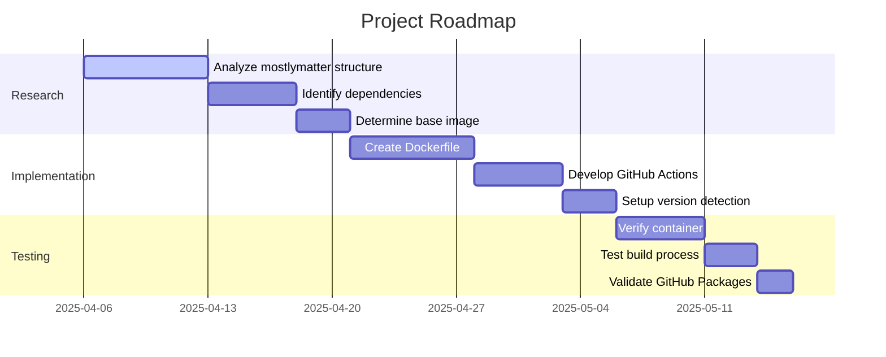

# Active Context: Mostlymatter Docker

## Current Work Focus

The project is in its initialization phase. We are setting up the foundation for:

1. Creating a Docker containerization solution for mostlymatter
2. Implementing GitHub Actions workflows for automated builds
3. Setting up the publishing pipeline to GitHub Packages

## Recent Changes

1. Initialized the project repository
2. Created the Memory Bank documentation structure
3. Defined the project requirements and goals
4. Added README.md with basic project information

## Next Steps

## Active Decisions and Considerations

1. **Base Image Selection**
   - Need to determine the most appropriate base image (Alpine vs Debian slim)
   - Consider compatibility with mostlymatter dependencies
   - Balance size optimization with reliability

2. **Version Detection Strategy**
   - Decide how to automatically detect new upstream releases
   - Implement version extraction and tagging logic
   - Ensure version consistency between upstream and Docker images

3. **Multi-architecture Support**
   - Evaluate the need for multi-architecture builds (amd64, arm64)
   - Implement platform-specific optimizations if necessary

## Important Patterns and Preferences

1. **Minimalism**
   - Keep Docker images as small as possible
   - Include only necessary runtime dependencies
   - Optimize for security and performance

2. **Automation**
   - Automate all repetitive tasks
   - Minimize manual intervention in the build process
   - Ensure reproducible builds

3. **Documentation**
   - Maintain comprehensive documentation
   - Document all configuration options
   - Provide clear usage instructions

4. **Commit Convention**
   - Follow semantic release commit format (Conventional Commits)
   - Use appropriate prefixes (feat, fix, docs, chore, etc.)
   - Write clear, descriptive commit messages
   - Enable better version tracking and changelog generation

## Learnings and Project Insights

As the project is just starting, we will document learnings and insights here as they emerge during development.