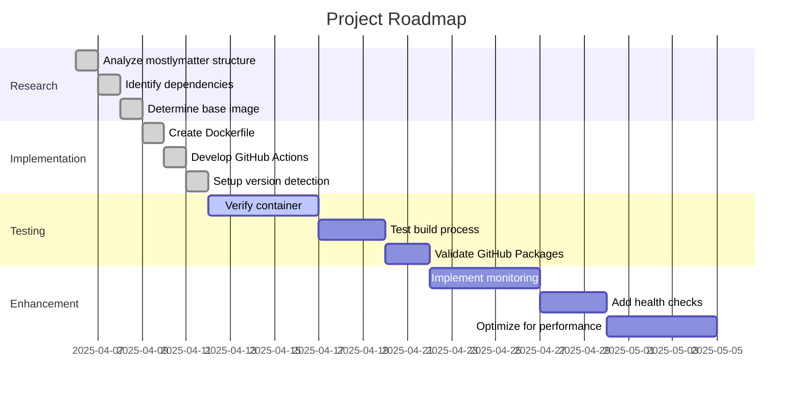

# Active Context: Mostlymatter Docker

## Current Work Focus

The project has progressed from initialization to implementation phase. We have:

1. Completed the analysis of mostlymatter structure
2. Created a Docker containerization solution for mostlymatter
3. Implemented GitHub Actions workflows for automated builds
4. Set up the publishing pipeline to GitHub Packages

## Recent Changes

1. Analyzed the mostlymatter repository structure and dependencies
2. Created a multi-stage Dockerfile for building minimal images
3. Implemented GitHub Actions workflow for automated builds
4. Added a script for triggering builds via repository_dispatch
5. Updated README.md with comprehensive documentation
6. Implemented multi-architecture support (amd64, arm64)

## Next Steps

## Active Decisions and Considerations

1. **Base Image Selection**
   - ✅ Decided to use Debian slim as the base image
   - ✅ Implemented multi-stage build to minimize final image size
   - ✅ Included only necessary runtime dependencies

2. **Version Detection Strategy**
   - ✅ Implemented both scheduled checks and repository_dispatch triggers
   - ✅ Created a script for external systems to trigger builds
   - ✅ Ensured version consistency between upstream and Docker images

3. **Multi-architecture Support**
   - ✅ Implemented support for both amd64 and arm64 architectures
   - ✅ Used Docker Buildx for cross-platform builds
   - ✅ Created multi-architecture manifests

4. **Security Considerations**
   - ✅ Run container as non-root user
   - ✅ Minimize included packages to reduce attack surface
   - ✅ Implement health checks for monitoring

## Important Patterns and Preferences

1. **Minimalism**
   - Keep Docker images as small as possible
   - Include only necessary runtime dependencies
   - Optimize for security and performance

2. **Automation**
   - Automate all repetitive tasks
   - Minimize manual intervention in the build process
   - Ensure reproducible builds

3. **Documentation**
   - Maintain comprehensive documentation
   - Document all configuration options
   - Provide clear usage instructions

4. **Commit Convention**
   - Follow semantic release commit format (Conventional Commits)
   - Use appropriate prefixes (feat, fix, docs, chore, etc.)
   - Write clear, descriptive commit messages
   - Enable better version tracking and changelog generation

## Learnings and Project Insights

1. **Mostlymatter Understanding**
   - Mostlymatter is not just a theme for Mattermost as initially thought, but a fork that removes user and message limits
   - The modifications are contained in a patch file called `limitless.patch`
   - Pre-compiled binaries are available at https://packages.framasoft.org/projects/mostlymatter/

2. **Containerization Approach**
   - Using pre-compiled binaries is more efficient than building from source
   - Multi-stage builds significantly reduce the final image size
   - Running as non-root user improves security

3. **Automation Strategy**
   - Repository dispatch events provide a more efficient alternative to polling
   - Weekly fallback checks ensure we don't miss any releases
   - Manual triggers give flexibility for testing and one-off builds