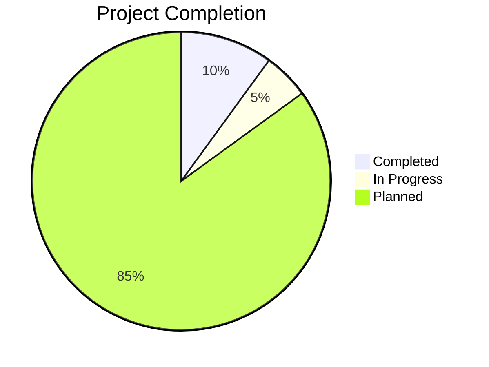

# Progress: Mostlymatter Docker

## Current Status

**Project Phase**: Initialization



The project is in its early stages. We have:
- Created the project repository
- Initialized the Memory Bank documentation
- Defined the project requirements and goals
- Added README.md with basic project information

## What Works

- Project structure is established
- Documentation framework is in place

## What's Left to Build

1. **Core Components**
   - Dockerfile for mostlymatter
   - GitHub Actions workflows
   - Version detection mechanism
   - Publishing pipeline to GitHub Packages

2. **Documentation**
   - Usage instructions
   - Configuration options
   - Deployment examples

3. **Testing**
   - Build verification
   - Functional testing
   - Security scanning

## Known Issues

No known issues at this stage as implementation has not yet begun.

## Evolution of Project Decisions

- **Semantic Release Commits**: Adopted conventional commit format to enable semantic versioning and better changelog generation. This will help maintain clear version history and automate version management.

As the project progresses, we will document additional key decisions and their evolution here.

## Milestones

```mermaid
timeline
    title Project Timeline
    section Current
        Project Initialization : Completed
        Research & Analysis : In Progress
    section Upcoming
        Dockerfile Creation : Planned
        CI/CD Implementation : Planned
        Testing & Validation : Planned
        Documentation : Planned
        Release v1.0 : Planned