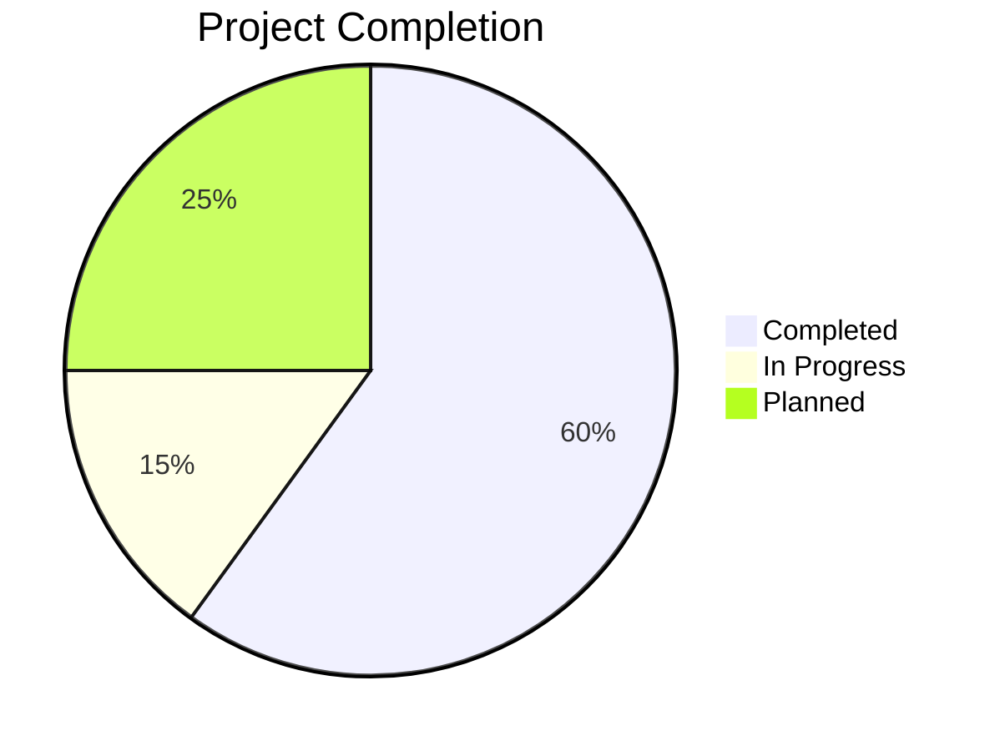

# Progress: Mostlymatter Docker

## Current Status

**Project Phase**: Implementation



The project has made significant progress. We have:
- Analyzed the mostlymatter structure and dependencies
- Created a multi-stage Dockerfile for building minimal images
- Implemented GitHub Actions workflow for automated builds
- Added a script for triggering builds via repository_dispatch
- Updated README.md with comprehensive documentation
- Implemented multi-architecture support (amd64, arm64)

## What Works

- Docker containerization solution for mostlymatter
- GitHub Actions workflow for automated builds
- Version detection and tracking mechanism
- Publishing pipeline to GitHub Packages
- Multi-architecture support (amd64, arm64)
- Comprehensive documentation

## What's Left to Build

1. **Testing**
   - Build verification
   - Functional testing
   - Security scanning

2. **Enhancements**
   - Monitoring and alerting
   - Performance optimizations
   - Additional deployment examples

3. **Integration**
   - Integration with external monitoring systems
   - Automated security scanning
   - Continuous deployment examples

## Known Issues

No known issues at this stage, but testing is required to validate the implementation.

## Evolution of Project Decisions

- **Base Image Selection**: Initially considered Alpine, but chose Debian slim for better compatibility with mostlymatter dependencies and better security support.

- **Version Detection Strategy**: Evolved from a simple polling approach to a hybrid approach using repository_dispatch events as the primary mechanism with weekly polling as a fallback.

- **Multi-architecture Support**: Decided to support both amd64 and arm64 architectures to maximize compatibility and reach.

- **Semantic Release Commits**: Adopted conventional commit format to enable semantic versioning and better changelog generation. This helps maintain clear version history and automate version management.

- **Mostlymatter Understanding**: Initially thought mostlymatter was just a theme for Mattermost, but discovered it's actually a fork that removes user and message limits.

## Milestones

```mermaid
timeline
    title Project Timeline
    section Completed
        Project Initialization : Done
        Research & Analysis : Done
        Dockerfile Creation : Done
        CI/CD Implementation : Done
        Documentation : Done
    section Current
        Testing & Validation : In Progress
    section Upcoming
        Enhancements : Planned
        Integration : Planned
        Release v1.0 : Planned