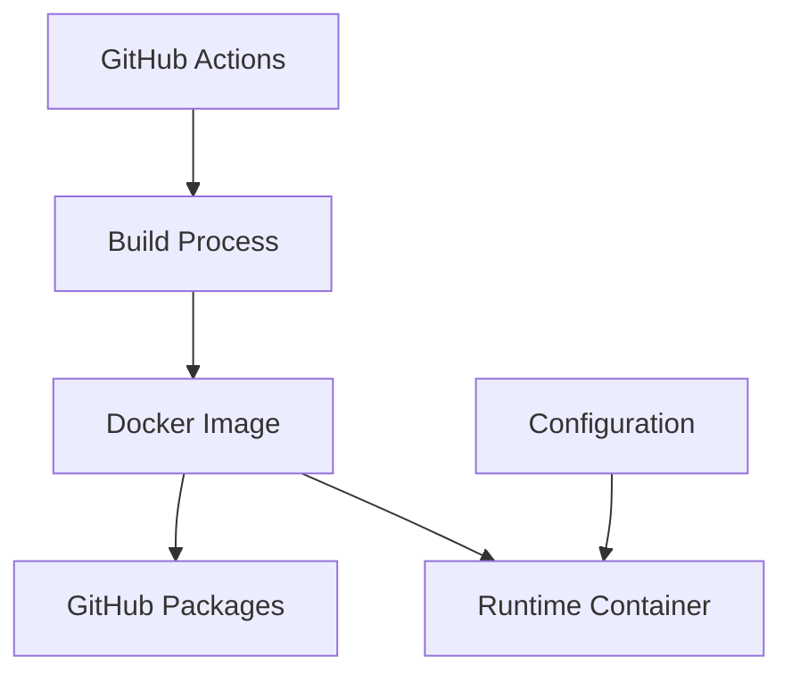

# System Patterns: Mostlymatter Docker

## Architecture Overview

This project follows a containerization architecture with automated CI/CD patterns:

## Key Technical Decisions

1. **Multi-stage Docker Builds**
   - Use multi-stage builds to minimize final image size
   - Separate build dependencies from runtime dependencies

2. **Automated Version Detection**
   - Automatically detect and build new versions from upstream
   - Maintain version parity between upstream and Docker images

3. **Minimal Base Images**
   - Use lightweight base images (e.g., Alpine or Debian slim)
   - Include only necessary runtime dependencies

4. **GitHub Actions as CI/CD**
   - Leverage GitHub Actions for automated building and testing
   - Implement workflows that respond to upstream releases

## Design Patterns

1. **Immutable Infrastructure**
   - Containers are treated as immutable artifacts
   - Configuration is injected at runtime, not baked into images

2. **Separation of Concerns**
   - Build process is separate from runtime configuration
   - Application code is separate from infrastructure code

3. **Versioning Strategy**
   - Docker images tagged with semantic versions matching upstream
   - Latest tag points to most recent stable release

## Component Relationships

## Critical Implementation Paths

1. **Version Detection → Build → Publish**
   - Detect new upstream versions
   - Build Docker images for each version
   - Publish to GitHub Packages with appropriate tags

2. **Configuration → Runtime**
   - Define configuration options
   - Implement runtime configuration injection
   - Document configuration parameters