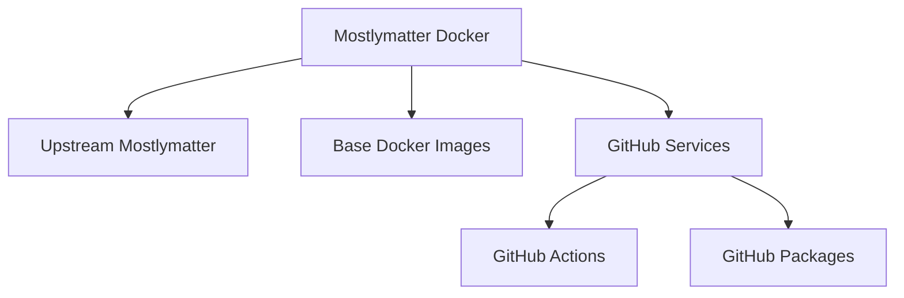

# Technical Context: Mostlymatter Docker

## Technologies Used

1. **Docker**
   - Used for containerization of the mostlymatter application
   - Enables consistent deployment across different environments

2. **GitHub Actions**
   - CI/CD platform for automating builds and deployments
   - Triggers workflows based on upstream releases

3. **GitHub Packages**
   - Container registry for storing and distributing Docker images
   - Provides versioning and access control

4. **Mostlymatter**
   - The upstream application being containerized
   - Developed by Framasoft and hosted on Framagit

## Development Setup

1. **Local Development Environment**
   - Docker and Docker Compose for local testing
   - Git for version control
   - Access to GitHub for CI/CD and package registry

2. **Repository Structure**
   - Dockerfile: Defines the container build process
   - GitHub Actions workflows: Automates the build and publish process
   - Documentation: Provides usage instructions
   - Memory Bank: Maintains project context and documentation

## Technical Constraints

1. **Upstream Compatibility**
   - Must maintain compatibility with all upstream mostlymatter releases
   - Cannot modify the core application code

2. **Container Size**
   - Must minimize the Docker image size while maintaining functionality
   - Balance between size optimization and build complexity

3. **Security**
   - Follow Docker security best practices
   - Minimize attack surface by reducing included packages
   - Run container processes with least privilege

## Dependencies

## Tool Usage Patterns

1. **Docker**
   - Multi-stage builds for size optimization
   - Non-root users for security
   - Volume mounts for persistent data
   - Environment variables for configuration

2. **GitHub Actions**
   - Event-driven workflows (on new releases, on push)
   - Matrix builds for multiple architectures/versions
   - Caching for build optimization
   - Secrets for sensitive information

3. **Version Management**
   - Semantic versioning aligned with upstream
   - Automated version detection and tagging
   - Latest tag for most recent stable release